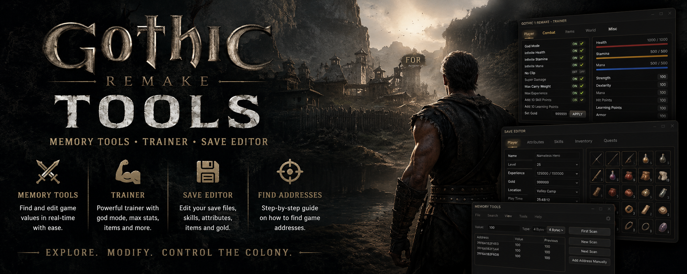

# Gothic 1 Remake — Community Trainer & Memory Tools

  

[-8B4513?style=flat-square)]()

Open-source toolkit for **Gothic 1 Remake** (Alkimia Interactive / THQ Nordic, released June 5, 2026, Unreal Engine 5).

Useful if you want to:
- play without the grind (infinite health/mana/stamina, free experience and ore),
- unstuck broken quests,
- edit save files,
- and generally get quality-of-life improvements not yet present in the base game.

> Fan project. Not affiliated with Alkimia Interactive, Piranha Bytes, or THQ Nordic. Use at your own risk — always back up your saves before using these tools.

---

## Download

[Latest Release](../../releases/latest)

Supported game version and platform (Steam / Epic / GOG) are listed in each release's description.

---

## Features

- Infinite health / mana / stamina
- Free editing of experience, level, and ore (Lumps of Ore)
- Remove inventory weight limit
- Movement speed multiplier
- Fixes for known stuck/broken quests
- Save editor: character, skills, inventory, bestiary, quest states

---

## Requirements

- Windows 10/11 x64
- Gothic 1 Remake (any supported platform — see release notes)
- Cheat Engine 7.5+ (for memory tables)

---

## Quick Start

1. Download the latest release from the Releases section.
2. Launch the game and load your save.
3. Open the table/tool and attach it to the game process.
4. Enable the features you need.

Detailed instructions: `docs/guide.md`.

---

## Contributing

The game receives regular updates, and memory addresses may shift after patches. If something stops working:

1. Check whether your game version matches the one listed in the latest release.
2. Open an Issue using the "Broken addresses" template, including your version and platform.
3. If you're comfortable with Cheat Engine, see `docs/finding-addresses.md` and submit a PR.

Community contributions are what keep this project alive after every patch — new features, translations, and documentation fixes are all welcome.

---

## Support the Project

If this tool was useful, consider starring the repository — it helps other players discover the project and keeps it active after future updates.

---

## Disclaimer

- Not intended for use in online/multiplayer modes or to gain an unfair advantage where prohibited by platform rules.
- Modifying memory values may cause instability or save corruption.
- Authors are not responsible for any issues — always keep backups.

---

## License

MIT — see LICENSE
